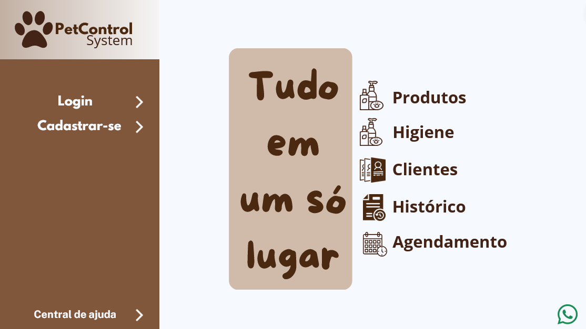
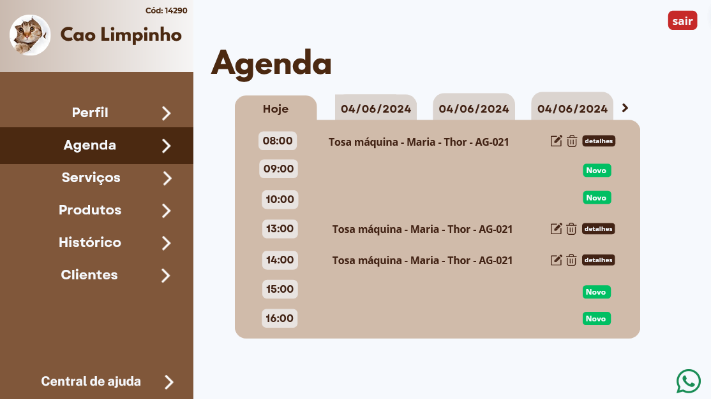
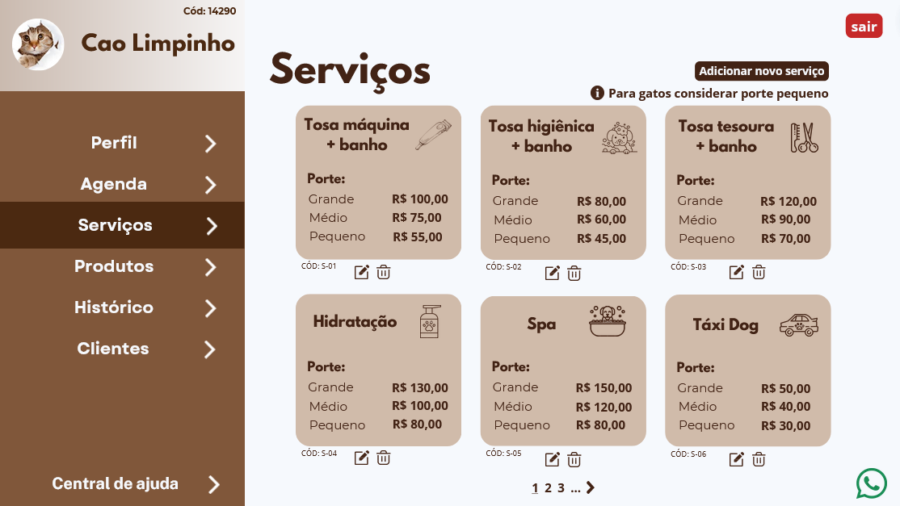
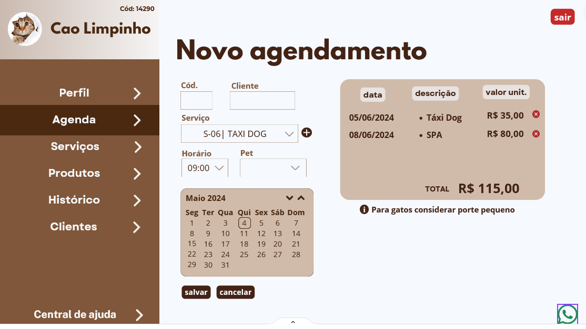
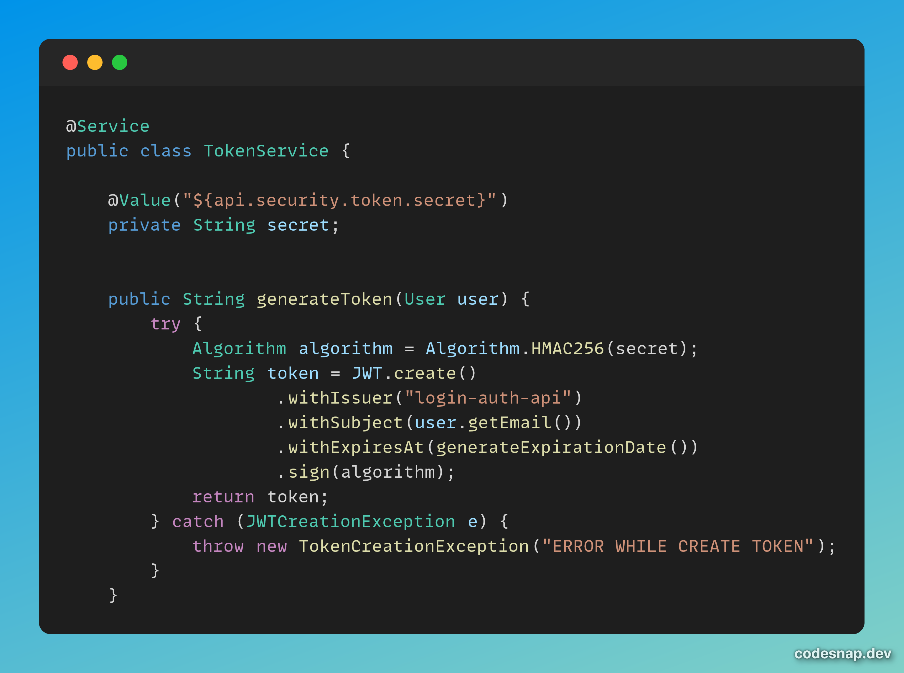
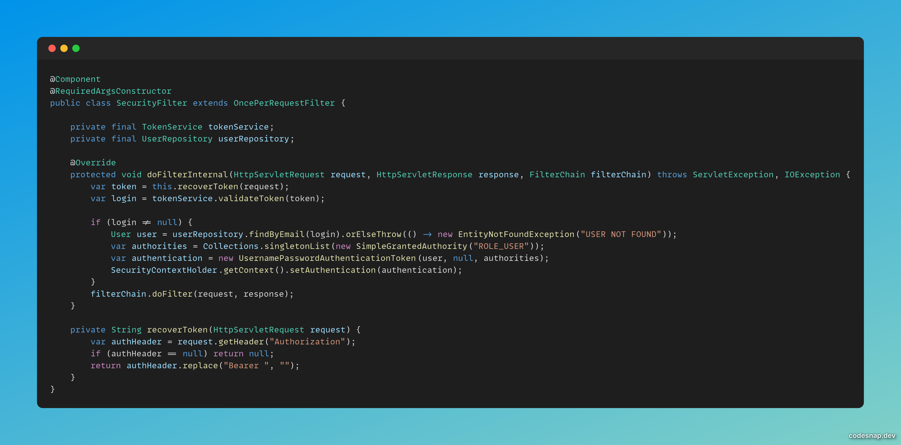

# PetControl System (Repositório Back-end)

Neste repositório contém todo o Backend do sistema PetControl. O PetControl System consiste em fornecer uma solução eficiente, confiável e segura para os donos de pet shops gerenciarem seus negócios de forma mais simples e organizada. O sistema possui módulos de gestão de clientes e seus animais, produtos, agendamentos, serviços prestados e históricos de vendas e agendamentos.

## Apresentação das telas

Abaixo, algumas telas de como ficará o projeto depois de pronto. 

<p align="center">
  
  
  
  
</p>

Para ver todas as telas segue o link para o projeto no site do Canva. https://tinyurl.com/4e6z47ys

## Tecnologias utilizadas

Neste projeto foi utilizado as seguintes Tecnologias Backend:

- Java
- Spring Boot
- Spring Data JPA
- Spring Security
- Bean Validation
- JavaMailSender
- Java JWT (OAtuh 0)
- H2 Database (test)
- JUnit
- Mockito

## Arquitetura

O sistema contempla a arquitetura em camadas contendo as seguintes camadas:

- Controladores
- Models
- Repositories
- Infra (config, security)
- Services

## Segurança

A parte de segurança da aplicação conta com a criação de tokens JWT. Todas as requisições passam por um filtro personalizado onde esse filtro trata os tokens.




Os únicos endpoints que são públicos, são:

- /auth/login : Página de login
- /auth/register: Página de registro de um novo usuário
- /auth/passwordRecover: Página de recuperação de senha
- /auth/confirmCode: Página de confirmação do código recebido no email para recuperação de senha.


## Banco de dados e seeding

Atualmente esse projeto contém apenas as configurações de banco de dados para o banco de dados de teste H2. Na pasta resources do projeto, contém o arquivo import.sql para o seeding do banco. Futuramente será utilizado o banco de dados PostgreSQL em um container Docker.


## Testes

Este projeto utiliza JUnit e Mockito para testes unitários. A cobertura de testes abrange todas as camadas do projeto, incluindo controladores, serviços e repositórios.

Para executar os testes, você pode usar o seguinte comando no terminal:

```bash
mvn test
```

## Instalação 

Para rodar o projeto em sua máquina há duas formas:

1. Clonar o repositório: Certifique-se de ter o Java 21 instalado e utilize alguma IDE de sua preferência. Clone este repositório para alguma pasta de seu computador utilizando os seguintes comandos:
 ```bash
git clone https://github.com/mateusf-prog/petcontrol-system.git.
```
Depois de clonado, abra sua IDE e execute o arquivo "PetcontrolsystemApplication.java" neste diretório:
```java
src/main/java/com/mateus/petcontrolsystem/PetcontrolsystemApplication.java
```

2. Ambiente Docker: ainda indisponível

## Autores

- [Mateus Fonseca - GitHub](https://github.com/mateusf-prog)
- [Mateus Fonseca - LinkedIn](https://www.linkedin.com/in/mateus-fprog)